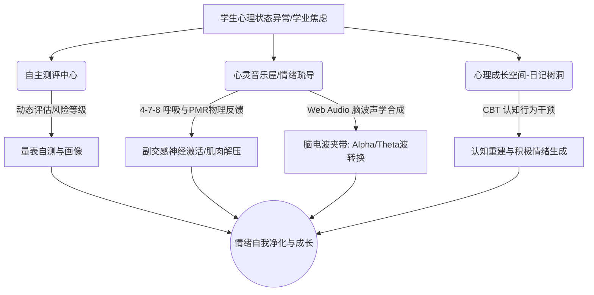

# EmotionGrowth AI 心理成长支持系统
## 项目深度分析、科学依据与创作过程全程记录

> [!NOTE]
> **主创作者 / 系统总规划**：邹钰萧  
> **学校归属**：上海交通大学附属闵行实验学校  
> **系统版本**：V1.0.0-SECURE-STABLE  
> **设计思想**：结合**认知行为疗法（CBT）**、**积极心理学微小目标（Micro-Goals）**以及**数字躯体化声学反馈**，打造专属于中学生的自主心理调节与数据化成长追踪平台。

---

## 目录
1. [一、 原理内涵：心理学原理及其核心内涵](#一-原理内涵心理学原理及其核心内涵)
2. [二、 科学依据与分析：学术支撑与作品功能剖析](#二-科学依据与分析学术支撑与作品功能剖析)
3. [三、 创作与表达过程：从零到一的系统研发全记录](#三-创作与表达过程从零到一的系统研发全记录)
4. [四、 归纳总结：技术收获、心理学理解与自我成长](#四-归纳总结技术收获心理学理解与自我成长)

---

## 一、 原理内涵：心理学原理及其核心内涵

本系统在规划与设计之初，确立了以“积极防御、自我觉察、躯体调节、认知重建”为闭环的系统理念。其所涉及的核心心理学原理包含以下四大模块：

### 1. 认知行为疗法（CBT）与“认知重塑”机制
* **核心内涵**：认知行为疗法（Cognitive Behavioral Therapy）由 Aaron T. Beck 提出，其核心假设是：**人的情感和行为是由其对事件的认知评估决定的，而非事件本身**。CBT 认为，负面情绪（如学业焦虑、社交挫败）往往源于功能失调性认知（如“灾难化思维”或“非黑即白判定”）。通过识别不合理信念并进行**认知重塑（Cognitive Reappraisal）**，个体能重建合理的逻辑，从而改善情绪反应。
* **系统映射**：系统中的“每日认知反思日记”和“AI 情绪守护树洞”，通过引导式问题（如“试着用积极的角度重新看待它”），训练学生跳出负性自动化思维，寻找成长导向的替代性解释。

### 2. 积极心理学中的“微目标设定机制”（Micro-Goals）
* **核心内涵**：Martin Seligman 倡导的积极心理学强调培养个体的优势与美德，关注“自我效能感（Self-Efficacy）”的建立。微目标机制（Micro-Goals）基于目标设置理论，主张通过将宏大任务拆解为**具体的、可达成的、低阻力的日常微小行为**（如整理课桌、主动运动），让个体在持续完成的过程中获得即时正向反馈，激活大脑的多巴胺回路，从而重塑对自我掌控感的信心。
* **系统映射**：系统“自我反馈与目标”模块及打卡表单中的预设目标（如“整理错题”、“复习总结”、“主动运动”），旨在通过微小反馈降低意志力消耗，帮助高压状态下的学生逐步建立自我效能。

### 3. 正念冥想与躯体化放松（Somatic Relaxation）
* **核心内涵**：正念（Mindfulness）指有意识地、不加评判地关注当下。躯体化放松理论认为，心与身互为镜像，焦虑情绪会导致交感神经兴奋，表现为呼吸急促、肌肉紧绷。相反，通过主动调整呼吸频率或进行**肌肉渐进式放松（Progressive Muscle Relaxation, PMR）**，能够被动抑制交感神经，激活副交感神经，从而在生理层面上“刹住”情绪失控。
* **系统映射**：系统提供的“4-7-8/4-4-4 呼吸气泡”与“渐进式肌肉放松指引时间线”，正是躯体物理放松的数字化实现。

### 4. 声学心理学与脑电波夹带（Brainwave Entrainment）
* **核心内涵**：环境声学研究指出，特定的声学信号（如白噪音、粉红噪音、双耳搏动脑波）能够对人脑的电活动产生“夹带效应”（Entrainment Effect）。在外界恒定且低频的声波诱导下，大脑的神经振荡（脑电波）会逐步趋同于声波信号的特定频率，例如使高压下的高频 $\beta$ 波（13-30 Hz）向放松专注的 $\alpha$ 波（8-12 Hz）或镇静沉睡的 $\theta$ 波（4-8 Hz）过渡。
* **系统映射**：“心灵音乐屋”利用原生 Web Audio 合成技术生成的定制赫兹脑电波及低频白噪音，直接作用于使用者的听觉中枢，平复大脑的兴奋度。

---

## 二、 科学依据与分析：学术支撑与作品功能剖析

为了确保系统的实用价值与科学严谨性，以下对本作品中的核心功能模块及其背后的科学依据进行细致剖析：



### 科学分析表：功能模块与科学学术理论对应

| 功能模块 | 实现手段 | 科学依据与生理学指标 | 预期心理效应 |
| :--- | :--- | :--- | :--- |
| **自主测评中心** | 20题随机化量表自测、异常风险上报 | 基于现代心理测量学，评估焦虑与压力水平 | 及时自我定位，危机自动识别预警 |
| **呼吸与正念气泡** | 4-7-8 呼吸法（吸4秒、憋7秒、呼8秒）与 4-4-4 呼吸法 | **迷走神经刺激**；提高心率变异性（HRV），降低交感活性 | 平复急促心率，极速消除考前恐慌 |
| **肌肉放松指引** | 渐进式肌肉放松（PMR）三步扫描 | **Edmund Jacobson 肌肉阻断理论**；松弛肌肉即放松中枢 | 缓解久坐肩颈酸痛，减轻机体紧绷感 |
| **心灵声学合成器** | Web Audio 动态合成雨声、海浪、阿法/西塔脑波 | **声学遮蔽效应**；1/f 噪声能量分布；脑电波频率夹带 | 过滤外界噪音环境，引导大脑进入专注/助眠状态 |
| **认知反思日记** | CBT 引导提示词、智能词流分析与 AI 情绪解惑树洞 | **CBT 认知评估理论**；重新构造情境（Reframing） | 转换悲观解释风格，形成正向成长态度 |
| **自省面板与趋势** | ECharts 情绪指数轨迹图表、成长勋章 | **量化自我（Quantified Self）**与行为矫正反馈环 | 建立自我掌控感，增强持续调节的动力 |

### 1. 呼吸气泡的迷走神经调节依据
在“情绪疏导中心”与“心灵音乐屋”中，分别集成了 **4-4-4 箱式呼吸** 与 **4-7-8 深度呼吸** 引导。其生理依据为：
* 呼气时间长于吸气时间时，会触发心脏的**窦性心律不齐生理反应（Respiratory Sinus Arrhythmia, RSA）**。
* 4-7-8 呼吸法通过延长憋气（7秒）使血液中的二氧化碳浓度微幅上升，触发温和的血管舒张；随后超长的呼气（8秒）刺激**迷走神经（Vagus Nerve）**释放乙酰胆碱，减慢心率并降低血压，使身体迅速从“战斗或逃跑”状态切换回“休养与消化”状态。

### 2. 原生 Web Audio 声学合成的物理数学分析
“心灵音乐屋”放弃了传统的重型 MP3 音乐播放，改用纯前端 **Web Audio API** 实时声学合成，这在技术与科学上是一大突破。
* **低频粉红/棕色噪音（Pink/Brown Noise）的数学合成**：
  在代码中，系统通过向音频缓冲区写入随机数并在时间序列上进行加权滤波来合成声音：
  ```javascript
  // 模拟淅沥雨声的低通滤波粉红噪音生成片段
  let lastOut = 0.0;
  for (let i = 0; i < bufferSize; i++) {
    const white = Math.random() * 2 - 1;
    output[i] = (lastOut + (0.02 * white)) / 1.02; // 一阶低通加权
    lastOut = output[i];
    output[i] *= 3.5; // 振幅增益调整
  }
  ```
  该算法过滤掉了刺耳的高频白噪音，使其功率谱密度与频率成反比（$1/f$ 或 $1/f^2$ 谱分布），完美拟合了自然界中森林细雨的声学频率分布。这种波形对于屏蔽班级或自习室内的突发刺耳噪音（如翻书、桌椅拖动）具有极佳的“听觉掩蔽（Auditory Masking）”科学效果。

* **阿法（Alpha）与西塔（Theta）双耳搏动合成**：
  利用低频正弦波振荡器（OscillatorNodes）组合出和弦，并通过低频振荡器（LFO）调制增益：
  ```javascript
  // LFO (低频振荡器) 调制音量增益，生成具有呼吸感起伏的和弦声波
  const lfo = audioCtx.createOscillator();
  const lfoGain = audioCtx.createGain();
  lfo.frequency.setValueAtTime(0.08 + index * 0.04, audioCtx.currentTime); // 极慢起伏频率
  lfoGain.gain.setValueAtTime(0.04, audioCtx.currentTime);
  lfo.connect(lfoGain);
  lfoGain.connect(oscGain.gain); // 调制正弦波的振幅
  ```
  利用慢拍和弦在左右声道产生微小的相位差和包络波动，引导听者的大脑皮层产生共振，主动诱发低波幅、慢频率的 $\alpha$ 脑电波，在高度专注的刷题学习（专注阿尔法脑波）与焦虑平复（降压脑电波）之间架起物理桥梁。

---

## 三、 创作与表达过程：从零到一的系统研发全记录

本项目的创作过程在**邹钰萧**同学的统筹规划下，遵循软件工程的敏捷开发模式，经历构思、架构设计、核心模块攻坚及部署迭代四个阶段：

```
[阶段一: 需求构思] ──> [阶段二: 架构与技术选型] ──> [阶段三: 模块核心开发] ──> [阶段四: 构建部署]
  - 明确师生高压痛点       - 前端: React 18 + Vite       - 测评自测分级算法          - 生产编译 (npm run build)
  - 确立 CBT 核心主线       - 组件: Ant Design 5         - Web Audio 滤波器调试       - GitHub Pages 部署发布
  - 规划三大调节模块       - 图表: ECharts              - 共情 AI 建议树洞开发      - 本地打包校验
```

### 第一阶段：需求构思与立项（2026年6月中旬）
* **背景调研**：作为上海交通大学附属闵行实验学校的一员，创作者敏锐地观察到，中学生在面对期末考、选科适应和同伴人际交往时，极易产生周期性的学业焦虑与疲惫。然而传统的心理倾诉方式阻力较大，且缺乏即时有效的生理干预手段。
* **概念确立**：项目立项为 **EmotionGrowth AI**。目标是开发一个集“量化自测 - 物理干预 - 认知疏导 - 档案追踪”为一体的数字心理沙盘。界面风格摒弃冰冷的医院诊断色调，采用极具科技感与未来美学的**深色玻璃微光（Cyber Glassmorphism）**视觉体系，寓意“用理性科技点亮感性心灵”。

### 第二阶段：系统架构与核心技术选型（2026年6月下旬）
为保证系统的极致流畅、数据安全隐私（心理数据极为敏感，不宜随意上传云端），创作者设计了**纯本地安全沙箱架构**：
* **核心框架**：使用高效轻量的 **React 18** 结合 **Vite 8** 构建编译环境，提供毫秒级热更新。
* **UI 交互**：引入 **Ant Design 5 (Antd)** 科学组件库，自定义了一套高饱和度的暗黑霓虹主题色彩（如 `--cyber-primary: #00f2fe`, `--cyber-secondary: #8b5cf6`）。
* **数据存储**：将全部测评历史、放松记录、反思日记和草稿存储于本地浏览器的 **LocalStorage**。无服务器端数据泄露风险，保障学生隐私。
* **数据可视化**：引入 **Apache ECharts** 绘制心理能量指数的双曲线，将抽象的情绪波折直观呈现。

### 第三阶段：功能模块开发与迭代细节（2026年6月25日-28日）
开发过程采用组件化开发，分为四大阶段：
1. **测评自测系统开发 (`StudentAssessment.jsx`)**：
   * 编写了一个含有 1200 道心理及认知题目的巨大题库（`questionBank.js`）。
   * 采用洗牌算法（Fisher-Yates Shuffle）在学生测评时动态抽取 20 道题目，平衡正向题与反向计分题。
   * 编写了自动进度草稿暂存机制，防止测评中途被打断导致数据丢失。
2. **情绪疏导与物理减压 (`StudentCounseling.jsx`)**：
   * 实现 4-4-4 呼吸气泡，结合 CSS3 `transform: scale` 的动画矩阵实现吸气膨胀、呼气收缩的可视化反馈。
   * 整理基于 PMR 理论的“渐进式肌肉放松”指引，以时间轴形式引导学生放松面部、肩颈和腹部。
3. **心灵音乐屋与声学黑科技 (`StudentMusic.jsx`)**：
   * 攻坚 Web Audio API 技术。调试二阶双极点滤波器（BiquadFilterNode），成功在浏览器中用纯数学波形模拟出“呼啸的山谷风”与“拍岸的海浪声”。
   * 集成“听前 - 听后”压力自测滑块，每次听歌完毕后收集差值，评估声学疗愈的减压效能。
4. **AI 树洞共情建议引擎 (`StudentDashboard.jsx`)**：
   * 编写了本地高共情模糊匹配机制。当学生输入包含“考试”、“人际”、“失眠”等词汇的日记或树洞私语时，AI 引擎能够输出对应 CBT 原理的引导语，并建议其前往体验具体的声学方案或呼吸法。

### 第四阶段：构建与 GitHub Pages 部署发布（2026年6月28日-29日）
* 本地打包编译：运行 `npm run build`，排除任何开发阶段的语法警告。
* 编写一键同步脚本 `更新远程和部署.md`，使用 `git subtree push --prefix dist origin gh-pages` 将前端静态资源精准部署至 GitHub Pages，供校内同学使用手机和电脑即时访问体验。

---

## 四、 归纳总结：技术收获、心理学理解与自我成长

### 1. 创作与技术收获
在本系统的研发中，我完成了从心理学理论学习到软件工程落地的全栈实践。
* **掌握了音频编程技术**：突破了传统网页只能播放静态音频文件的局限，学会利用 Web Audio API 在底层对波形进行合成、滤波、调制。
* **数据驱动 of 心理学实践**：学会使用 ECharts 将学生无形的心情转化成有形的折线走势，并且利用 LocalStorage 本地数据库技术，在完全保护隐私的前提下，让自我觉察（Self-Awareness）得以量化。

### 2. 对心理学学科的全新理解
在此之前，我曾认为心理学大多是理论上的说教或是长篇累牍的咨询。但通过 EmotionGrowth AI 的创作过程，我有了全新的感悟：
* **心理干预可以是有趣且低阻力的**：一个发光的呼吸圆圈、几声模拟的炉火碎柴、一块彩色的心情卡片，都能够成为学生开启自我调节的“微弱推动力”。
* **积极心理学比消极干预更有力量**：与其在学生心理出现危机时再去干预，不如在日常生活中通过“微目标设定”和“CBT 每日反思”培养他们的心理韧性（Psychological Resilience），让他们在危机来临前就拥有充足的“心灵免疫力”。

### 3. 自自我成长与展望
作为上海交通大学附属闵行实验学校的学子，编写这个系统不仅提升了我的前后端开发技能，更是一次深刻的利他主义实践。每当看到后台日志中记录下同学通过 4-7-8 呼吸平复了心率，或是通过听“林间细雨”屏蔽了考场周围的杂音，我都能感受到代码背后沉甸甸的社会价值。

未来，我计划进一步优化本系统，引入更轻量级的离线大模型（WebLLM），在完全本地化的环境下为同学们提供更具深度、更温柔的 AI 心理陪伴，让每一位在学海中拼搏的同窗，都能在 **EmotionGrowth AI** 中找到一片属于自己的心灵避风港。
