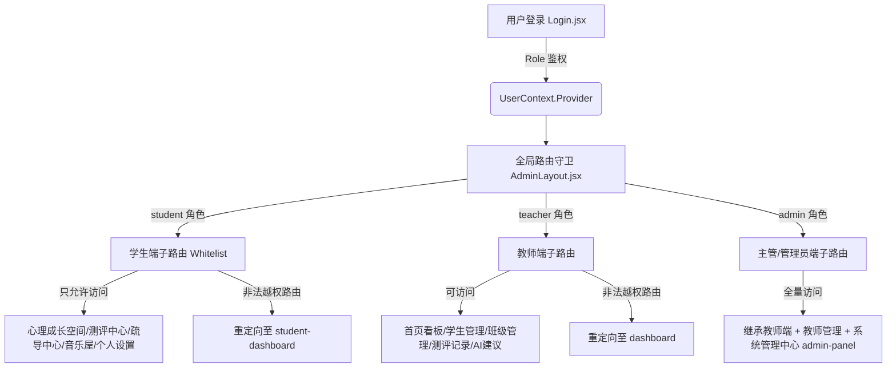

# EmotionGrowth AI 角色权限开发架构与研发流程解析

> [!IMPORTANT]
> **多角色协同定位**：本系统在同一个单页应用（SPA）中集成了学生端、教师端和主管端（管理员端）。通过前端路由守卫（Route Guard）以及统一的本地数据层实现多角色隔离与业务流闭环。

---

## 一、 三种权限的开发架构 (Permissions & Routing Architecture)

系统基于 React Context API 构建了用户全局状态 `UserContext`，并在顶层路由中集成了动态守卫机制与基于角色（RBAC）的访问控制。

### 1. 顶层路由防护与白名单拦截
在 `AdminLayout.jsx` 中，系统通过 `useEffect` 挂载了动态路由守护：
* **学生端（Student Whitelist）**：
  白名单仅包含 `['/student-dashboard', '/student-assessment', '/student-counseling', '/student-goals', '/student-music', '/student-profile', '/about']`。当检测到学生用户试图在浏览器地址栏手动输入 `/admin-panel` 或 `/students` 等教师/管理员路径时，路由守卫会执行静默拦截，并将其重定向回 `/student-dashboard`。
* **教师端（Teacher Whitelist）**：
  教师能够访问看板及班级管理，但无权访问 `/admin-panel`（管理员后台）和 `/student-dashboard`（学生打卡面板）。一旦触发，系统将其重定向至教师端首页 `/dashboard`。
* **主管/管理员端（Admin）**：
  拥有系统最高级控制权，可无限制流转于所有页面（包括配置模型、用户注销、审计日志查询等）。

### 2. 数据层设计架构（Unified Local DB Schemas）
三端并不独立运行，而是通过浏览器沙箱 `LocalStorage` 共享同一套**数据实体关系结构**：
* `registeredUsers`：存储三端所有账号数据。
* `studentsList`：教师与主管端管理学生的档案库，存储各班学生心理测评分数、关注风险等级（正常、轻度、中度、重点）及干预方案。
* `assessmentRecords`：学生在评测中心提交的详细答案流水，教师端及主管端可跨表检索调取自测报告明细。
* `assignedTasks`：教师端下发的“微目标”（如“主动运动”），学生可在“自我反馈与目标”中实时勾选确认，达成双向互动。
* `auditLogs`：主管端专用的操作审计日志，监控系统登录与操作行为。

---

## 二、 三个权限开发的研发过程 (Development Processes)

三端的开发流程遵循“自底向上、业务闭环”的次序，各端在开发时均有不同的侧重点：

### 1. 学生端开发过程：侧重于“生理干预与自我觉察”
学生端是最先进行研发的终端，其核心是降低倾诉和调节的阻力。
* **开发关键节点**：
  1. **测评引擎研发**：导入 1200 道心理问题数据库，开发随机化抽取算法，确保每次抽取的 20 道题维度均衡，并配置草稿箱缓存防丢失。
  2. **数字躯体化调节开发**：攻坚 HTML5 Web Audio API 技术，编写 procedural（过程化）音频合成算法调试低频白噪声和 $\alpha$/$\theta$ 脑波；开发 Box Breathing 4-4-4 和 4-7-8 呼吸动画。
  3. **AI 树洞模糊语义匹配**：编写本地匹配字典，将学生的日记文本与声学放松方案、正念建议进行联动推荐。

### 2. 教师端开发过程：侧重于“班级监控与干预下发”
教师端旨在帮助班主任和心理教师实时监控班级学生的异常波动，并下发行为处方。
* **开发关键节点**：
  1. **首页数字看板研发**：集成 4 个核心指标卡片，利用 ECharts 绘制班级健康风险饼图、7天新增预警折线图、以及各班心理平均分双轴柱状图。
  2. **智能危机警报系统**：编写自动轮询算法，一旦检测到有学生测评得分 $< 45$ 分或心情长期“郁闷”，自动在主页顶部触发高亮呼吸警报（Alert Banner），警示教师及时接入个别谈话。
  3. **干预与任务下发模块**：开发“心理干预记录”与“成长任务派发”表单，教师可直接派发“整理错题”、“主动运动”等微小目标，数据实时写入 `assignedTasks`，完成教与学的闭环。

### 3. 主管端（管理员端）开发过程：侧重于“系统合规与统筹管理”
主管端开发聚焦于保障校内心理管理系统的平稳运行、人员授权以及安全合规性。
* **开发关键节点**：
  1. **多角色账号生命周期管理**：开发统一的注册、修改与注销（销户）功能。支持销户时的“自愈型数据库清理”（即销户后自动擦除该用户在 `studentsList` 和 `assessmentRecords` 中的全部个人敏感隐私档案）。
  2. **AI模型及Prompt调试台**：开发系统控制台，允许主管在前端实时切换模拟 of AI 性能引擎提供商（如 DeepSeek-V3, GPT-4, Gemini 等），并支持调节 Temperature 参数与 System Prompt，以适应不同年级学生的心理共情话术风格。
  3. **合规审计系统（Audit Logging）**：挂载全局审计日志记录器 `addLog`。在每一次登录、修改密码、测评提交、干预下发时，自动记录操作员角色、行为描述、随机 IP 及高精度时间戳，供主管进行安全回溯。
