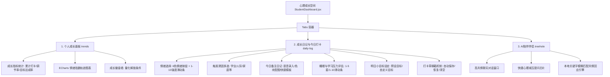

# 学生端“心理成长空间”模块开发手册与技术解析

> [!NOTE]
> **模块定位**：学生端核心入口页面（文件：[StudentDashboard.jsx](file:///c:/Users/Phodon/psychology-admin/src/views/StudentDashboard.jsx)）  
> **核心使命**：为学生提供“每日情绪自省与量化打卡”的低阻力入口，并通过可视化的方式反馈其心理成长轨迹，辅以高共情的 AI 对话和线下疗愈方案推荐。

---

## 一、 “心理成长空间”功能模块架构

在界面设计上，该页面采用 Ant Design 的 `Tabs` 选项卡组件作为顶层导航，将功能科学地划分成三个平行的子功能区域。



### 1. 个人成长面板（Trends）
该模块旨在帮助学生直观地回溯其情绪变化规律，增强“情绪控制”的自我暗示。
* **成长指标卡**：汇总展示“累计积极打卡天数”（统计状态为优秀、愉快、平静的天数）、“自我调节完成率”（积极心情占总心情打卡数的百分比）、“目标达成率”（联动自 LocalStorage `assignedTasks` 中的已完成比例）。
* **ECharts 情绪曲线图**：通过 ECharts 图表，将学生选择的文字心情转化为数值指标（优秀=100，愉快=85，平静=70，疲惫=50，烦躁=35，郁闷=20），并绘制平滑的折线阴影面积图。支持悬浮提示框显示打卡日记、睡眠星级与压力强度。
* **成长徽章墙**：设计了“探索先锋”、“情绪卫士”、“觉察行者”、“目标达人”四个成长勋章。**解锁逻辑完全由代码实时检索本地 LocalStorage 各数据库决定**（如自测分高低、是否写过反思日记等），未解锁的徽章置灰呈现并带有解锁提示，激发学生主动参与调节的意愿。

### 2. 成长日记与今日打卡（Daily Log）
打卡表单设计遵循“多维量化、极简录入、防丢草稿”的原则。
* **多维数据收集**：涵盖情绪颜色及强度、诱因选项（学业压力、人际关系等）、文本日记备注、睡眠质量评星、学习压力评估、以及明天的成长目标（支持自定义输入）。
* **快速交互与防疲劳设计**：
  * 提供快捷日记标签（如“😊 快乐小事”、“😔 遇到困扰”），点击即可填充高质量模板，减小打卡阻力。
  * 提供 **情绪色彩渐变色块配图**（🌇 灿烂晚照、🌱 坚毅新生等）作为精神图腾，增加仪式感。
  * 引入模拟的 **语音输入** 和波形动画，允许通过说话录音自动生成文本日记。
* **草稿暂存器（Draft System）**：
  在输入任何表单数据时，页面通过 `localStorage.setItem('diaryDraft_' + username, JSON.stringify(draft))` 将状态加密缓存。若学生误触刷新、切换页面或断网，再次进入时系统会自动检测并提示恢复进度。
* **AI 情绪深度分析反馈**：
  提交打卡后，系统通过加载动画引导，并根据选择的心情与日记内容通过本地共情引擎匹配，为学生渲染专属的“AI成长报告”以及跳转到呼吸法和音乐屋的快捷链接。

### 3. AI 情绪守护树洞（Treehole）
一个沉浸式的、轻量化的即时心理陪伴聊天沙箱。
* 提供快捷气泡芯片（如“帮我制定一个今天快速学习减压的微小建议”），双击或点击后自动发送提问。
* 本地匹配算法解析输入语句，识别特定敏感主题（如“学业高压”、“睡眠障碍”、“人际冲突”），并推荐对应的数字化调节法。

---

## 二、 关键技术实现与代码剖析

### 1. 情绪指数化与 ECharts 曲线的渲染逻辑
为了使抽象的情绪“可见、可量化”，开发过程中设计了 `moodValueMap`。在 `useEffect` 中，数据逆序排列（确保时间线从左向右流动），并利用 canvas 渲染。
```javascript
const moodValueMap = {
  优秀: 100,
  愉快: 85,
  平静: 70,
  疲惫: 50,
  烦躁: 35,
  郁闷: 20
};

// 提取 X轴日期 与 Y轴数值
const xData = dataToPlot.map(item => item.time.split(' ')[0]);
const yData = dataToPlot.map(item => moodValueMap[item.mood] || 70);

// ECharts 配置折线面积渐变
const option = {
  xAxis: { type: 'category', data: xData },
  yAxis: {
    type: 'value',
    axisLabel: {
      formatter: (val) => {
        if (val === 100) return '优秀 🌟';
        if (val === 85) return '愉快 😊';
        if (val === 70) return '平静 😐';
        if (val === 50) return '疲惫 🥱';
        if (val === 35) return '烦躁 ⚡';
        if (val === 20) return '郁闷 😢';
        return '';
      }
    }
  },
  series: [{
    data: yData,
    type: 'line',
    smooth: true,
    areaStyle: {
      color: new echarts.graphic.LinearGradient(0, 0, 0, 1, [
        { offset: 0, color: 'rgba(167, 139, 250, 0.25)' },
        { offset: 1, color: 'transparent' }
      ])
    }
  }]
};
```

### 2. 徽章墙的实时查询逻辑
未解锁的徽章采用 CSS 滤镜 `filter: grayscale(100%) opacity(0.35)` 置灰，只有当相应的 LocalStorage 数据触发满足条件时，徽章才亮起解锁：
```javascript
const checkBreathingBadge = () => {
  try {
    const saved = localStorage.getItem('reflectiveLogs');
    if (saved && JSON.parse(saved).length > 0) return true;
  } catch {}
  return checkInHistory.length > 0; // 只要写过日记打卡也算解锁
};

const checkGoalsBadge = () => {
  try {
    const saved = localStorage.getItem('assignedTasks');
    if (saved) {
      const parsed = JSON.parse(saved);
      // 判断当前登录学生是否有已完成的任务
      return parsed.some(t => t.studentName === userInfo.nickname && t.status === '已完成');
    }
  } catch {}
  return false;
};
```

---

## 三、 开发过程全程日志 (5个核心步骤)

“心理成长空间”作为学生核心流量阵地，从功能立项到测试部署共经历了以下五个研发节点：

### 步骤 1：需求分析与产品定位 (Requirement Analysis)
* 针对中学生打卡容易产生的“厌烦感”进行优化。产品设计阶段决定不采用密集的心理问卷作为日常打卡，而采用“**打卡颜色代表心情 + 可选多选框**”的极低阻力交互。
* 明确以“**隐私第一**”为开发红线，决定开发过程中的所有敏感数据处理都在纯前端完成，由 React 管理统一的 Application State。

### 步骤 2：UI 布局与暗黑微光设计系统建设 (UI Sketch & Theme Design)
* 构建暗黑系“赛博心理沙箱”UI，利用 React 开发通用 `.cyber-card` 和自定义情绪按钮：
  ```css
  .mood-btn {
    padding: 16px;
    background: rgba(255,255,255,0.01);
    border: 1px solid rgba(255,255,255,0.06);
    border-radius: 8px;
    text-align: center;
    cursor: pointer;
    transition: all 0.3s;
  }
  .mood-btn.active {
    background: rgba(var(--theme-color-rgb), 0.08);
    border: 1px solid var(--theme-color);
    box-shadow: 0 0 15px var(--theme-shadow);
  }
  ```
* 建立 Antd Tabs 路由锚点，确保学生在 trends（个人成长面板）、daily-log（成长日记）、treehole（AI 树洞）三大模块之间无缝切换。

### 步骤 3：数据层持久化与草稿系统对接 (State Management & Local Database)
* 在 React `useState` 的初始化闭环中绑定 LocalStorage 提取机制。
* 编写表单监听逻辑。每当用户选择心情、改变 Slider 强度、键入文字时，自动触发防抖（Debounce）函数，将当前修改写入草稿 LocalStorage。
* 建立 `handleSaveDiaryDraft` 和 `handleClearDiaryDraft` 清理草稿机制，彻底杜绝输入中途丢失的痛点。

### 步骤 4：ECharts 响应式画布集成与徽章锁集成 (Visual Canvas Integration)
* 导入 ECharts 并搭建挂载容器 `trendChartRef = useRef(null)`。
* 解决画布切换 tab 时宽度坍塌的 Bug：监听 Tab 切换事件，并在 Tab 进入活跃状态时显式调用 `myChart.resize()` 刷新渲染宽度。
* 绑定 Window resize 监听器，确保在学生使用移动端设备或平板电脑访问时，情绪走势曲线能够自适应缩放。

### 步骤 5：本地 AI 共情逻辑与模拟外设联动 (Empathy Engine & Mock Devices)
* 开发基于关键字字典的本地共情引擎。若学生打卡日记包含“数学”、“考试”等高压词汇，智能分发正向激励话术，并推荐对应的音乐曲目和呼吸训练。
* 使用 CSS3 动画编写**语音识别动画（等化波形跳动）**和**心情渐变配图模态框**，大大提升了打卡界面的交互体验和科技感。
* 打包项目并一键上传 GitHub Pages 稳定测试。
